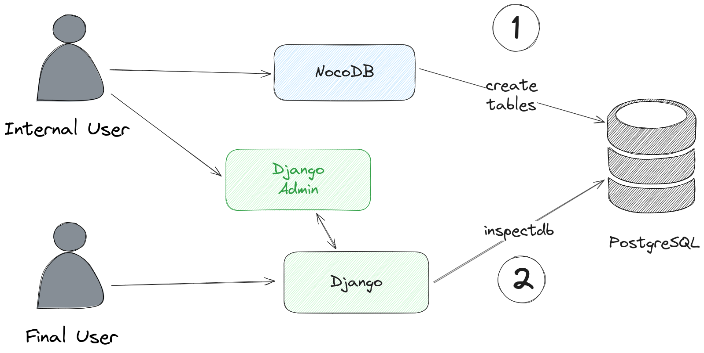
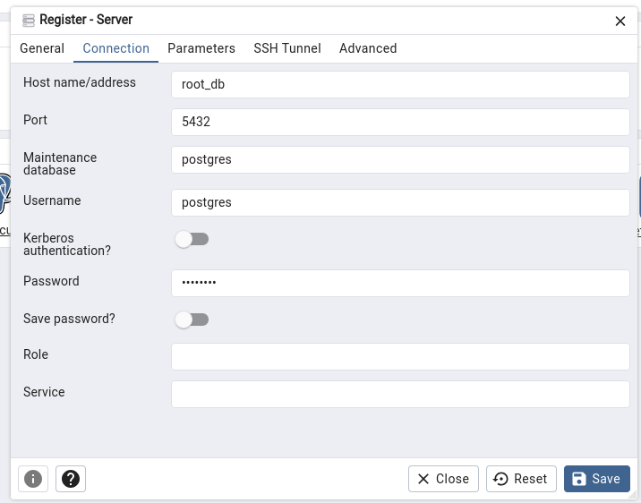

# NocoDB Django Example

[NocoDB](https://github.com/nocodb/nocodb)

**Doc:** https://nocodb.com/


# Install

## This project was done with:

* [Django 5.0.6](https://www.djangoproject.com/)
* [NocoDB](https://nocodb.com/)
* [PostgreSQL](https://www.postgresql.org/)

## How to run project?

* Clone this repository.
* Create virtualenv with Python 3.
* Active the virtualenv.
* Install dependences.
* Run the migrations.

```
https://github.com/rg3915/nocodb-django-example.git
cd nocodb-django-example

python -m venv .venv
source .venv/bin/activate

pip install -r requirements.txt

docker-compose up -d

python contrib/env_gen.py

python manage.py migrate
python manage.py createsuperuser --username="admin" --email=""

python manage.py runserver
```

#### docker-compose

https://github.com/nocodb/nocodb/blob/develop/docker-compose/pg/docker-compose.yml

Enter in http://0.0.0.0:8080/dashboard/#/signup

> Create tables on NocoDB.


## How does it work?

This project runs NocoDB along with Django and PostgreSQL.

With it, you can use the NocoDB interface and Django Admin.

1. First, you need to create the tables in NocoDB.
2. Then, using the command

`python manage.py inspectdb`

you retrieve the models of the created tables and edit your `models.py`.

3. Finally, just run

`python manage.py makemigrations` and

`python manage.py migrate`




## Django step by step


Create virtualenv.

```
python -m venv .venv
source .venv/bin/activate
```

Generate `.env`

```
python contrib/env_gen.py
```

Install the libs.

```
pip install -r requirements.txt
```

Create Django project.

```
django-admin startproject backend .
```

Create apps.

```
cd backend
python ../manage.py startapp core
python ../manage.py startapp product
```


Edit `settings.py`

```python
# settings.py
from pathlib import Path

from decouple import config, Csv


BASE_DIR = Path(__file__).resolve().parent.parent

SECRET_KEY = config('SECRET_KEY')

DEBUG = config('DEBUG', default=False, cast=bool)

ALLOWED_HOSTS = config('ALLOWED_HOSTS', default=[], cast=Csv())


INSTALLED_APPS = [
    'django.contrib.admin',
    'django.contrib.auth',
    'django.contrib.contenttypes',
    'django.contrib.sessions',
    'django.contrib.messages',
    'django.contrib.staticfiles',
    # others apps
    'django_extensions',
    # my apps
    'backend.core',
    'backend.product',
]

DATABASES = {
    'default': {
        'ENGINE': 'django.db.backends.postgresql',
        'NAME': config('POSTGRES_DB', 'root_db'),
        'USER': config('POSTGRES_USER', 'postgres'),
        'PASSWORD': config('POSTGRES_PASSWORD', 'password'),
        'HOST': config('DB_HOST', 'localhost'),
        'PORT': config('DB_PORT', 5431, cast=int),
    }
}


STATIC_URL = 'static/'
STATIC_ROOT = BASE_DIR.joinpath('staticfiles')
```

Edit `core/apps.py`

```python
# core/apps.py
from django.apps import AppConfig


class CoreConfig(AppConfig):
    default_auto_field = 'django.db.models.BigAutoField'
    name = 'backend.core'
```

Edit `product/apps.py`

```python
# product/apps.py
from django.apps import AppConfig


class ProductConfig(AppConfig):
    default_auto_field = 'django.db.models.BigAutoField'
    name = 'backend.product'
```

### Inspectdb

Run Inspectdb.

```
python manage.py inspectdb
```

Edit `product/models.py`

```python
# product/models.py
from django.db import models

from backend.core.models import TimeStampedModel, CreatedBy


class Product(TimeStampedModel, CreatedBy):
    title = models.CharField(max_length=100, blank=True, null=True)
    category = models.ForeignKey(
        'Category',
        on_delete=models.CASCADE,
        related_name='products',
        db_column='nc_t_52___Category_id',
        null=True,
        blank=True
    )

    class Meta:
        managed = False
        db_table = 'nc_t_52__Product'

    def __str__(self):
        return f'{self.title}'


class Category(TimeStampedModel, CreatedBy):
    title = models.CharField(max_length=100, blank=True, null=True)

    class Meta:
        managed = False
        db_table = 'nc_t_52___Category'

    def __str__(self):
        return f'{self.title}'
```

Edit `product/admin.py`

```python
# product/admin.py
from django.contrib import admin

from .models import Product, Category


@admin.register(Product)
class ProductAdmin(admin.ModelAdmin):
    list_display = ('__str__',)
    search_fields = ('title',)
    list_filter = ('category',)


admin.site.register(Category)
```

Run

```
python manage.py makemigrations
python manage.py migrate
python manage.py runserver
```

Open

http://localhost:8000/admin/


## PG Admin

http://0.0.0.0:5051/


```
host: root_db
port: 5432
username: postgres
password: password
```


